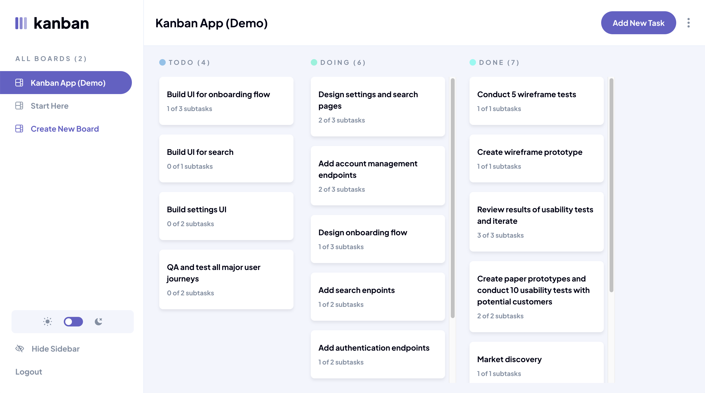

# Task Board App

## Overview

This is a full-stack solution to the [Kanban task management web app challenge on Frontend Mentor](https://www.frontendmentor.io/challenges/kanban-task-management-web-app-wgQLt-HlbB). Frontend Mentor challenges help you improve your coding skills by building realistic projects.

### Features

- **Task Management**: Create, edit, and delete tasks within different boards.
- **Responsive Design**: Fully responsive design that works seamlessly on various devices.
- **Dark Mode**: Dark mode toggle for better accessibility and user preference.
- **Drag and Drop**: Move tasks between columns with drag-and-drop functionality.
- **Routing**: Navigation with React Router V6 Data APIs.
- **State Management**: Modern React hooks and context for state management.
- **Styling**: Custom styling using CSS modules for modular and maintainable styles.
- **User Authentication**: Secure user authentication.
- **Backend API**: Efficient data querying with GraphQL.
- **Infrastructure as Code**: Automated infrastructure management with AWS CDK.
- **Deployment pipeline**: Automated deployment pipeline using AWS CodePipeline.

### Technologies Used

- **React**: For building the user interface.
- **CSS Modules**: For modular and maintainable styles.
- **React Router**: For handling routing within the application.
- **React Query**: For data fetching and caching.
- **React Hook Form**: For managing form state.
- **React DnD Kit**: For implementing drag-and-drop functionality.
- **Netlify**: For hosting the frontend.
- **Node.js/NestJS**: For building the server-side application and API.
- **GraphQL**: For API queries and mutations.
- **PostgreSQL**: For the database management system.
- **JSON Web Tokens (JWT)**: For secure authentication.
- **Docker**: For containerizing the application.
- **AWS**: For cloud hosting and services, including VPC, ECS, RDS, Codepipline and Cloudformation.
- **AWS CDK**: For defining cloud infrastructure as code.

## About

In March 2023, I decided to take a year-long break from work to focus on independent learning. During this break, I spent most of my time reading, practising and studying topics in mathematics (mostly related to 3D computer graphics), functional programming, database internals, and computer architecture.

At the start of 2024, to prepare for my return to work, I decided to brush up on my web development skills and complete a small portfolio project. During this period, I completed [Josh Comeau's CSS-for-JS course](https://css-for-js.dev/) and spent time learning modern React. I then spent the next few months (March-May) working part-time on this project.
